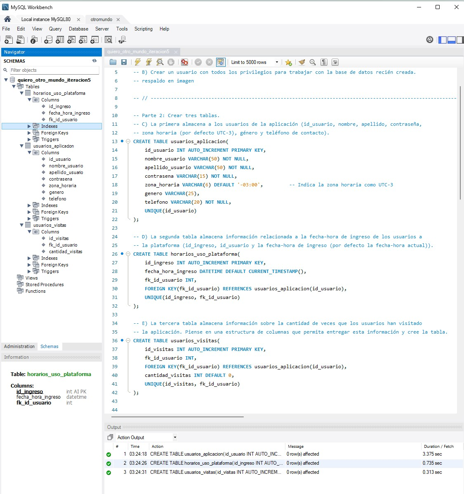

**_<h1 align="center">:vulcan_salute: Ejercicio Individual Número 5 :computer:</h1>_**
**_<h2 align="center">Módulo 3 - Fundamentos de Bases de Datos Relacionales</h2>_**

- Creación de tres tablas e ingreso de datos
- Eliminación de una tabla

